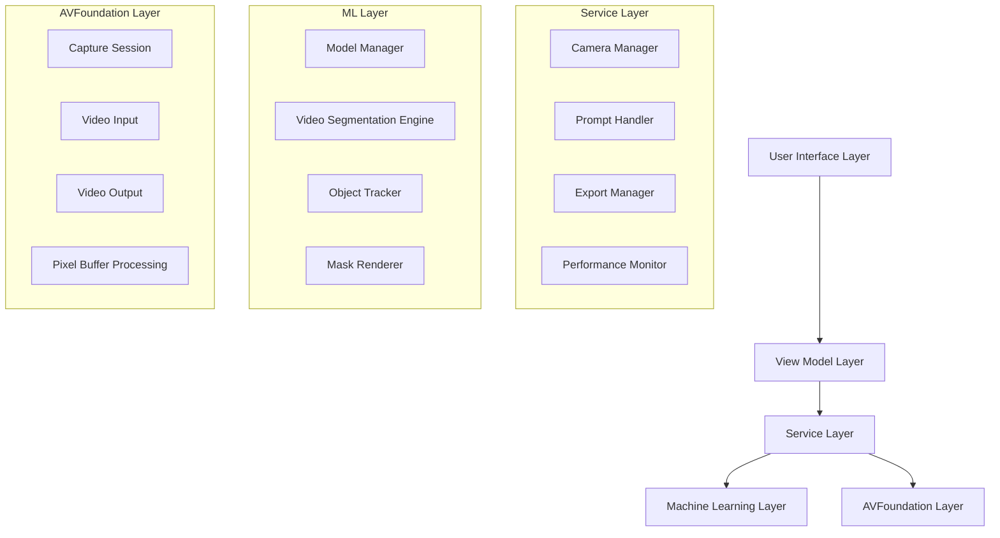

# Design Document: EdgeTAM iOS Application

## Overview

This document outlines the design for an iOS application that integrates Meta's EdgeTAM (Track Anything Model) with Apple's CoreML framework to provide real-time video segmentation and object tracking capabilities. The application leverages on-device machine learning to deliver high-performance video processing while maintaining user privacy and enabling offline functionality.

The system architecture follows a modular design with clear separation of concerns between video capture, machine learning inference, user interaction, and rendering components. The application targets iPhone 15 Pro Max and similar devices, achieving real-time performance of 15+ FPS for video processing and segmentation.

## Architecture

The application follows a layered architecture pattern with the following main components:



### Layer Responsibilities

- **User Interface Layer**: SwiftUI views for camera preview, controls, and overlays
- **View Model Layer**: MVVM pattern implementation with Combine for reactive updates
- **Service Layer**: Business logic coordination and state management
- **Machine Learning Layer**: CoreML model management and inference pipeline
- **AVFoundation Layer**: Low-level video capture and processing

## Components and Interfaces

### Camera Manager

The Camera Manager handles all video capture operations using AVFoundation:

```swift
protocol CameraManagerProtocol {
    func startSession() async throws
    func stopSession()
    func switchCamera() async throws
    func setVideoOutput(delegate: AVCaptureVideoDataOutputSampleBufferDelegate)
    var isRunning: Bool { get }
    var currentDevice: AVCaptureDevice? { get }
}

class CameraManager: NSObject, CameraManagerProtocol {
    private let captureSession = AVCaptureSession()
    private let videoOutput = AVCaptureVideoDataOutput()
    private let sessionQueue = DispatchQueue(label: "camera.session.queue")
    
    // Implementation handles session configuration, device management,
    // and pixel buffer delivery to processing pipeline
}
```

### Model Manager

The Model Manager handles EdgeTAM CoreML model lifecycle and inference:

```swift
protocol ModelManagerProtocol {
    func loadModel() async throws
    func performInference(on pixelBuffer: CVPixelBuffer, 
                         with prompts: [Prompt]) async throws -> SegmentationResult
    var isModelLoaded: Bool { get }
    var inferenceTime: TimeInterval { get }
}

class ModelManager: ModelManagerProtocol {
    private var edgeTAMModel: MLModel?
    private let inferenceQueue = DispatchQueue(label: "ml.inference.queue")
    
    // Implementation handles CoreML model loading, memory management,
    // and batch inference optimization
}
```

### Video Segmentation Engine

The core processing engine that coordinates inference and tracking:

```swift
protocol VideoSegmentationEngineProtocol {
    func processFrame(_ pixelBuffer: CVPixelBuffer, 
                     with prompts: [Prompt]) async throws -> ProcessedFrame
    func updateTracking(for frame: ProcessedFrame) async throws -> [TrackedObject]
    var currentFPS: Double { get }
}

class VideoSegmentationEngine: VideoSegmentationEngineProtocol {
    private let modelManager: ModelManagerProtocol
    private let objectTracker: ObjectTrackerProtocol
    private let frameProcessor = FrameProcessor()
    
    // Implementation coordinates model inference with temporal tracking
}
```

### Object Tracker

Maintains object identity and temporal consistency across frames:

```swift
protocol ObjectTrackerProtocol {
    func initializeTracking(for objects: [SegmentedObject]) throws
    func updateTracking(with newFrame: ProcessedFrame) throws -> [TrackedObject]
    func removeObject(withId id: UUID)
    var trackedObjects: [TrackedObject] { get }
}

class ObjectTracker: ObjectTrackerProtocol {
    private var activeObjects: [UUID: TrackedObject] = [:]
    private let trackingQueue = DispatchQueue(label: "tracking.queue")
    
    // Implementation uses EdgeTAM's temporal features and confidence scoring
}
```

### Prompt Handler

Manages user interaction and prompt generation:

```swift
protocol PromptHandlerProtocol {
    func addPointPrompt(at location: CGPoint, in frame: CGRect)
    func addBoxPrompt(with rect: CGRect, in frame: CGRect)
    func clearPrompts()
    var activePrompts: [Prompt] { get }
}

enum Prompt {
    case point(CGPoint)
    case box(CGRect)
    case mask(CVPixelBuffer)
}

class PromptHandler: PromptHandlerProtocol {
    private var prompts: [Prompt] = []
    
    // Implementation converts UI coordinates to model input format
}
```

### Mask Renderer

Handles overlay rendering and visual feedback:

```swift
protocol MaskRendererProtocol {
    func renderMasks(_ masks: [SegmentationMask], 
                    on pixelBuffer: CVPixelBuffer) -> CVPixelBuffer
    func setOpacity(_ opacity: Float)
    func setColorPalette(_ colors: [UIColor])
}

class MaskRenderer: MaskRendererProtocol {
    private let metalDevice = MTLCreateSystemDefaultDevice()
    private var renderPipeline: MTLRenderPipelineState?
    
    // Implementation uses Metal for efficient GPU-based overlay rendering
}
```

## Data Models

### Core Data Structures

```swift
struct ProcessedFrame {
    let pixelBuffer: CVPixelBuffer
    let timestamp: CMTime
    let segmentationMasks: [SegmentationMask]
    let metadata: FrameMetadata
}

struct SegmentationMask {
    let objectId: UUID
    let maskBuffer: CVPixelBuffer
    let confidence: Float
    let boundingBox: CGRect
}

struct TrackedObject {
    let id: UUID
    let masks: [SegmentationMask] // Historical masks for temporal consistency
    let trajectory: [CGPoint]
    let confidence: Float
    let isActive: Bool
}

struct FrameMetadata {
    let frameNumber: Int
    let processingTime: TimeInterval
    let inferenceTime: TimeInterval
    let memoryUsage: UInt64
}

struct PerformanceMetrics {
    let currentFPS: Double
    let averageInferenceTime: TimeInterval
    let memoryPressure: Float
    let thermalState: ProcessInfo.ThermalState
}
```

### Configuration Models

```swift
struct AppConfiguration {
    let maxTrackedObjects: Int = 5
    let targetFPS: Int = 15
    let maskOpacity: Float = 0.6
    let confidenceThreshold: Float = 0.7
    let memoryWarningThreshold: Float = 0.8
}

struct ModelConfiguration {
    let modelName: String = "EdgeTAM"
    let inputSize: CGSize = CGSize(width: 1024, height: 1024)
    let batchSize: Int = 1
    let useNeuralEngine: Bool = true
}
```

## Error Handling

The application implements comprehensive error handling with specific error types:

```swift
enum EdgeTAMError: LocalizedError {
    case cameraPermissionDenied
    case cameraInitializationFailed
    case modelLoadingFailed(String)
    case inferenceTimeout
    case memoryPressure
    case thermalThrottling
    case exportFailed(String)
    
    var errorDescription: String? {
        switch self {
        case .cameraPermissionDenied:
            return "Camera access is required for video processing"
        case .modelLoadingFailed(let reason):
            return "Failed to load EdgeTAM model: \(reason)"
        // Additional cases...
        }
    }
}
```

Error recovery strategies include:
- Graceful degradation when memory pressure occurs
- Automatic retry mechanisms for transient failures
- User-friendly error messages with actionable guidance
- Fallback modes for reduced functionality scenarios

## Correctness Properties

*A property is a characteristic or behavior that should hold true across all valid executions of a system—essentially, a formal statement about what the system should do. Properties serve as the bridge between human-readable specifications and machine-verifiable correctness guarantees.*

### Property 1: Camera Initialization and Frame Processing
*For any* device with camera capabilities, when the application starts, the Camera_Manager should successfully initialize and deliver video frames to the processing pipeline at the target frame rate.
**Validates: Requirements 1.1, 1.2, 1.3**

### Property 2: Prompt Registration and Response Time
*For any* valid user interaction (point tap or box drawing), the Prompt_Handler should register the coordinates correctly and the Video_Segmentation_Engine should generate an initial segmentation mask within 200ms.
**Validates: Requirements 2.1, 2.2, 2.3**

### Property 3: Multi-Object Tracking Consistency
*For any* set of up to 5 tracked objects, the Object_Tracker should maintain unique identities and consistent tracking across video frames, updating masks to follow object movement.
**Validates: Requirements 3.1, 3.2, 3.5**

### Property 4: Mask Rendering Performance
*For any* generated segmentation masks, the Mask_Renderer should overlay them on the video feed with distinct colors for different objects while maintaining real-time performance without frame drops.
**Validates: Requirements 4.1, 4.2, 4.4**

### Property 5: CoreML Model Integration and Performance
*For any* video frame processed through the EdgeTAM CoreML model, the Model_Manager should achieve inference times under 60ms while utilizing Neural Engine acceleration when available.
**Validates: Requirements 5.1, 5.2, 5.5**

### Property 6: Adaptive Performance Management
*For any* system state with high resource usage (memory >80%, high CPU, or thermal pressure), the Performance_Monitor should trigger appropriate optimization strategies while maintaining core functionality.
**Validates: Requirements 6.2, 6.3, 6.4**

### Property 7: Export Processing Integrity
*For any* video export operation, the Export_Manager should process the recorded video with applied segmentation masks while maintaining original resolution and frame rate, with progress tracking and cancellation support.
**Validates: Requirements 7.1, 7.2, 7.3, 7.4**

### Property 8: UI State Consistency
*For any* user interaction or system state change, the user interface should provide immediate visual feedback and accurately reflect the current processing state through appropriate UI elements.
**Validates: Requirements 8.2, 8.3**

### Property 9: Privacy and Data Protection
*For any* video processing operation, the system should perform all inference on-device, automatically clean up temporary files, and handle background transitions by pausing processing and clearing sensitive data from memory.
**Validates: Requirements 9.1, 9.2, 9.3, 9.4**

### Property 10: EdgeTAM Feature Utilization
*For any* EdgeTAM model interaction, the system should properly configure both point and box prompt modes, maintain temporal consistency across video sequences, and correctly parse mask predictions with confidence scores.
**Validates: Requirements 10.1, 10.2, 10.3, 10.4, 10.5**

### Property 11: Object Re-acquisition After Occlusion
*For any* tracked object that temporarily leaves the frame, the Object_Tracker should attempt re-acquisition when the object returns to the visible area.
**Validates: Requirements 3.3**

### Property 12: Opacity Control Functionality
*For any* mask opacity setting between 0% and 80%, the Mask_Renderer should apply the specified transparency level to all rendered segmentation masks.
**Validates: Requirements 4.3**

### Property 13: Camera Switching Continuity
*For any* camera switch operation (front to rear or vice versa), the system should maintain processing continuity without interrupting the video segmentation pipeline.
**Validates: Requirements 1.5**

### Property 14: Prompt Capacity Limits
*For any* number of simultaneous prompts up to 5, the system should handle all prompts correctly, and for any number exceeding 5, the system should gracefully handle the limitation.
**Validates: Requirements 2.4**

### Property 15: Orientation Adaptation
*For any* screen orientation change, the system should maintain full usability and functionality of all video processing and tracking features.
**Validates: Requirements 8.5**

## Testing Strategy

The application will employ a dual testing approach combining unit tests for specific scenarios and property-based tests for universal correctness validation.

### Unit Testing Approach

Unit tests will focus on:
- **Specific examples and edge cases**: Camera permission denial, invalid prompts, export failures
- **Integration points**: AVFoundation to CoreML pipeline, UI to service layer communication
- **Error conditions**: Model loading failures, memory pressure scenarios, thermal throttling
- **State transitions**: App backgrounding, camera switching, object re-acquisition

Unit tests will use XCTest framework with mock objects for external dependencies like AVFoundation and CoreML components.

### Property-Based Testing Approach

Property-based tests will verify universal properties across randomized inputs using the Swift-Check library (or similar PBT framework for Swift). Each property test will:
- **Run minimum 100 iterations** to ensure comprehensive input coverage
- **Generate randomized test data** including video frames, user interactions, and system states
- **Reference design document properties** using the tag format: **Feature: edgetam-ios-app, Property {number}: {property_text}**

**Property Test Configuration:**
- Framework: Swift-Check or custom PBT implementation
- Iterations per test: 100 minimum
- Timeout per test: 30 seconds
- Memory limit per test: 512MB

**Example Property Test Structure:**
```swift
// Feature: edgetam-ios-app, Property 1: Camera Initialization and Frame Processing
func testCameraInitializationProperty() {
    property("Camera initialization delivers frames at target rate") <- forAll { (deviceConfig: DeviceConfiguration) in
        let cameraManager = CameraManager(configuration: deviceConfig)
        let frameCounter = FrameCounter()
        
        return cameraManager.startSession()
            .flatMap { _ in cameraManager.captureFrames(duration: 1.0) }
            .map { frames in frames.count >= 15 } // Minimum 15 FPS
    }
}
```

### Integration Testing

Integration tests will verify end-to-end workflows:
- Complete video capture to export pipeline
- Real-time processing with actual EdgeTAM model
- Multi-object tracking scenarios
- Performance under various device conditions

### Performance Testing

Performance tests will validate:
- Frame processing rates under different loads
- Memory usage patterns during extended operation
- Thermal behavior during intensive processing
- Battery consumption optimization

The testing strategy ensures comprehensive coverage while maintaining fast feedback cycles for development iterations.